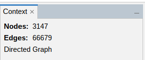
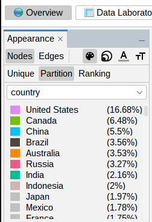
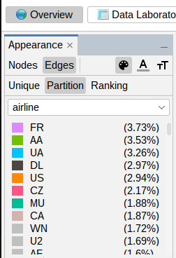
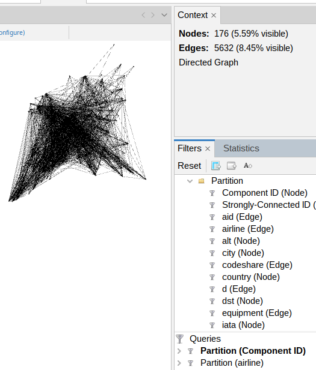
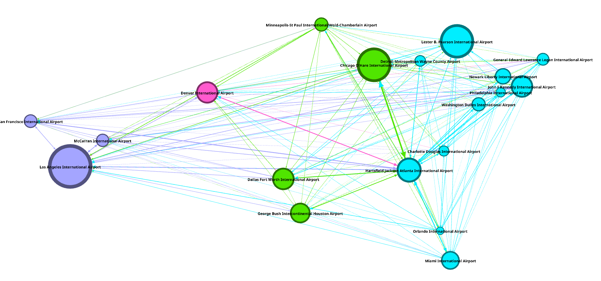

# Flight Network Analysis using Gephi

## Dataset
For this exercise, we analyze a flight network obtained from the OpenFlights dataset. The dataset is provided in GEXF format, which can be downloaded from:

[Flights Network Dataset](http://www.dcc.fc.up.pt/~pribeiro/aulas/ns2425/homework/flights.zip)

## Questions & Answers

### (a) What is the number of airports and flights in the network?
- **Steps Taken:**
  - Loaded the GEXF file into Gephi, choosing the not to merge option.
  - In the *Context* window we can see our graph has 
  - Check the *Graph Overview* for the number of nodes (airports) and edges (flights).

- **Results:**
  - **Number of airports (nodes):** 3147
  - **Number of flights (edges):** 66679

### (b) On average, an airport has how many outgoing flights? And to how many different airports?

Both parts of this question can be answered using the *Average Degree* statistic in Gephi. In the first, we check the average *out-degree* of the nodes with the **Not merging** strategy as opose to the second part where we can use some **merge** strategy and check the average *out-degree* of the nodes.

Since in a directed graph the sum of all in-degrees equals the sum of all out-degrees. 

AvgDegree = Avg In-Degree + Avg Out-Degree  
Avg Out-Degree = AvgDegree/2

- **Steps Taken:**
  - Loaded the GEXF file into Gephi, choosing the **not to merge** option.
  - In the *Statistics* panel, select the *Average Degree* statistic 
  - Observed a *Average Degree* of 21.188. Making the average out-degree 10.594.

   

  - Loaded the GEXF file into Gephi, choosing the **merge** option.
  - In the *Statistics* panel, select the *Average Degree* statistic.
  - Observed a *Average Degree* of 21.188. Making the average out-degree 11.699.

- **Results:**
  - **Average outgoing flights per airport:** `10.594`
  - **Average number of destinations per airport:** `11.699`

### (c) What is the diameter and average path length of the network?
- **Steps Taken:**
  - Ran the *Network Diameter* statistic.
  - Observed a *Diameter* of 13 and a *Average Path Length* of 3.969.

- **Results:**
  - **Network Diameter:** `13`
  - **Average Path Length:** `3.969`

### (d) List the top-5 pairs of airports with more flights between each other.
- **Steps Taken:**
  - Loaded the GEXF file into Gephi, choosing the **sum merge strategy.**
  - Used the *Edges Table* to sort edges by weight.
  - Extracted the following top-5 pairs with the highest edge weights.

- **Results:**
  - **Top-5 airport pairs with highest flights:**
    1. `3830 - 3682` (Flights: `20`)
    2. `3682 - 3830` (Flights: `19`)
    3. `3179 - 3885` (Flights: `13`)
    4. `3830 - 3861` (Flights: `13`)
    5. `3682 - 3576` (Flights: `12`)

### (e) List the top-5 of the airports that have flights to the highest number of other airports.
We achieve this by loading the graph with a merge strategy (in our case we used SUM) so each pair of airports only has one edge between them, and then finding nodes with the highest out-degree.

- **Steps Taken:**
  - Loaded the GEXF file into Gephi, choosing the **SUM merge strategy**.
  - Ran the *Average Degree* statistic in the *Statistics* panel (this calculates in-degree and out-degree for all nodes).
  - Went to the *Data Laboratory* and selected the *Nodes* table.
  - Sorted the table by the 'Out-Degree' column in descending order.
  - Identified the top 5 nodes (airports) based on their Out-Degree. 

- **Results:**
  - **Top-5 airports by number of destinations (Out-Degree):**
    1. `340` (Out-Degree: `239`)
    2. `1382` (Out-Degree: `237`)
    3. `580` (Out-Degree: `232`)
    4. `1701` (Out-Degree: `224`)
    5. `3682` (Out-Degree: `217`)

### (f) List the top-5 of the airports with highest normalized betweenness centrality.

Betweenness Centrality measures how often a node lies on the shortest paths between other nodes. Normalized centrality adjusts this value, typically to a range between 0 and 1.

- **Steps Taken:**
  - Ran the *Network Diameter* statistic in the *Statistics* panel, choosing the option *Normalize centralities*.
  - Went to the *Data Laboratory* and selected the *Nodes* table.
  - Sorted the table by the 'Betweenness Centrality' column in descending order.
  - Identified the top 5 nodes (airports).
- **Results:**
  - **Top-5 airports by Normalized Betweenness Centrality:**
    1. `3484` (Betweenness Centrality: `~0.085`) - Los Angeles International Airport (LAX)
    2. `1382` (Betweenness Centrality: `~0.072`) - Charles de Gaulle International Airport (CDG)
    3. `507` (Betweenness Centrality: `~0.062`) - London Heathrow Airport (LHR)
    4. `3364` (Betweenness Centrality: `~0.057`) - Beijing Capital International Airport (PEK)
    5. `3830` (Betweenness Centrality: `~0.055`) - Chicago O'Hare International Airport (ORD)

### (g) Consider Ted Stevens Anchorage International Airport. What is its global ranking in terms of betweenness centrality and out-degree? Can you explain the discrepancy? Indicate two other airports with the same kind of behavior (high betweenness centrality but relatively low out-degree).

- **Steps Taken:**
  - Identified in the *Data Laboratory* that the Ted Stevens Anchorage International Airport (ID `3774`, IATA: ANC) has the 8th highest betwenness centrality(0.0526) and the  274th highest out-degree (59).
  - To facilitate the analysis, only selected the columns of interest: `ID`,`IATA`,`Out-Degree`, `Betweenness Centrality`. Sorted by `Betweenness Centrality` (descending).
  - From here we notice the Guarulhos Airport (ID `2564`) and the Brisbane International Airport (ID `3320`) have a similar behavior of high betweenness centrality but low out-degree. With Guarulhos having a betweenness centrality of `0.048` and an out-degree of 193, and Brisbane having a betweenness centrality of `0.035` and an out-degree of `151`.

  - **Explanation of Discrepancy:** TODO

### (h) List the top-5 of countries with the highest number of airports.

- **Steps Taken:**
  - Loaded the GEXF file into Gephi.
  - In the *Overview* panel, selected the *Nodes* and *Partition* tabs.
  - Chose the *country* attribute from the list of available attributes.

  

- **Results:**
  - **Top-5 countries by number of airports:**
    1. United States (16.68%)
    2. Canada (6.48%)
    3. China (5.5%)
    4. Brazil (3.56%)
    5. Australia (3.53%)

### (i) List the top-5 of airlines with the highest number of flights. (info about airline codes)

- **Steps Taken:**
  - Loaded the GEXF file into Gephi.
  - In the *Overview* panel, selected the *Edges* and *Partition* tab.
  - Chose the *country* attribute from the list of available attributes.

- **Results:**
  - **Top-5 airlines by number of flights:**
    1. `FR`: (3.73%)
    2. `AA`: (3.53%)
    3. `UA`: (3.26%)
    4. `DL`: (2.97%)
    5. `US`: (2.94%)

### (j) What is the number of domestic flights inside China?

- **Steps Taken:**
  - Loaded the GEXF file into Gephi (no merge required).
  - Went to the Filters panel (right side).
  - Expanded Attributes -> Partition.
  - Dragged Node country into the Queries are, selected China from the list.
  - Observed an edge count of 7101

- **Results:**
  - Number of domestic flights inside China: 1346

### (k) How many airports in USA fly to at least 50 other airports in the global network?

-   **Steps Taken:**
    1.  Loaded the GEXF file. When prompted about multiple edges, chose the **First merge strategy** to ensure each pair of connected airports (in a specific direction) has only one edge.
    2.  In the *Statistics* panel, under *Network Overview*, ran the **Average Degree** statistic. This computes the `Out-Degree` for each node.
    3.  Went to the *Filters* panel.
    4.  Configured the individual filters first:
        *   Under *Attributes* -> *Partition*, selected `Node: country`. In its parameters, chose `United States`.
        *   Under *Attributes* -> *Range*, selected `Node: Out-Degree`. In its parameters, set the range to `[50.0 .. Max]`.
    5.  Expanded the *Operator* category in the *Filters* library. Dragged the **`INTERSECTION`** operator into the main *Queries* section below.
    6.  Dragged the configured `Node: country` filter (set to United States) and dropped it **onto** the `INTERSECTION` operator in the *Queries* section, nesting it underneath.
    7.  Dragged the configured `Node: Out-Degree` filter (set to >= 50) and dropped it **onto** the same `INTERSECTION` operator, nesting it alongside the country filter.
    8.  Clicked the **Filter** button at the bottom of the Filters panel.

-   **Results:**
    -   **Number of airports in USA flying to at least 50 other airports:** `29`

### (l) How many flights are there between Portugal and Brazil?

-   **Steps Taken:**
    1.  Loaded the GEXF file. When prompted about multiple edges, chose the **not merge strategy**.
    2.  Went to the *Filters* panel.
    3.  Expanded the *Attributes* category in the *Filters* library. Dragged the **country** Filter and selected both Portugal and Brazil. Observed an edge cound of 1300 (E_total = 1300)
    4.  Modify the filter to select only Portugal. Click Filter. Observe edge count: 101. (E_pt = 101)
    5.  Modify the filter to select only Brazil. Click Filter. Observe edge count: 1175. (E_br = 1175)

-   **Results:**
    -   **Number of flights between Portugal and Brazil:** `1300 - 101 - 1175 = 24`

### (m) Consider a network formed only by Ryanair flights. What is the number of nodes and edges of its giant component? Considering only this giant component, what is the most important airport in terms of closeness centrality?

- **Steps Taken:**
  - Loaded the GEXF file into Gephi without merging multiple edges.
  - Applied a filter to include only edges where the "airline" attribute is "FR" (Ryanair).
  - Ran the "Connected Components" statistic to identify the giant component.
  - Filtered the network to display only the giant component using the largest "Component ID".
  - Noted the number of nodes and edges from the "Context" panel. (176 nodes, 5632 edges).
  - On the statistics panel, selected the *Network Diameter* statistic.
  - Sorted nodes by closeness centrality in the "Data Laboratory" to identify the top airport(London Stansted Airport - STN) with 0.782 closeness centrality.

- **Results:**
  - **Number of nodes in the giant component:** 176
  - **Number of edges in the giant component:** 5632
  - **Airport with the highest closeness centrality:** London Stansted Airport (STN) with a closeness centrality of 0.782.
  

### (n)  How many airport are reachable from Francisco de Sá Carneiro Porto Airport in 1 flight? And in at most 2 flights? And in at most 3 flights?

- **Steps Taken:**
  - Loaded the GEXF file into Gephi with the **SUM merge** strategy.
  - In data laboratory, used cntrol+f to search for the Francisco de Sá Carneiro Porto Airport (ID: 1636).
    3.  Went to the *Filters* panel -> *Topology*.
    4.  Dragged the **Ego Network** filter into the *Queries* area.
    5.  Configured the Ego Network filter:
        *   Set `ID` to `1636`.
        *   Set `Depth` to `1`.
        *   Set without self-loops.

        Notice the value `61` in the *Context* panel. This is the number of reachable airports from OPO in 1 flight.

    
    6.  Modified the Ego Network filter:
        *   Set `Depth` to `2`.

        Notice the value `755` in the *Context* panel. This is the number of reachable airports from OPO in 2 flights.

    7.  Modified the Ego Network filter:
        *   Set `Depth` to `3`.

        Notice the value `2376` in the *Context* panel. This is the number of reachable airports from OPO in 3 flights.

- **Results:**
  - **Number of airports reachable from Francisco de Sá Carneiro Porto Airport in 1 flight:** `61`
  - **Number of airports reachable from Francisco de Sá Carneiro Porto Airport in at most 2 flights:** `755`
  - **Number of airports reachable from Francisco de Sá Carneiro Porto Airport in at most 3 flights:** `2376`

I'll help you improve the formatting of section (o) to match the style of the other sections in your document. Here's my restructured version:

### (o) Create an image showing the flight network between american and canadian aiports with more than 100 destinations in the global network. The size of the nodes should reflect the global betweenness centrality, and their colors should be different for each time zone. Nodes should be labeled with the city name. Try to make your image as comprehensible and aesthetically pleasing as possible.

- **Steps Taken:**
  - Loaded the GEXF file into Gephi with the **SUM merge strategy** to ensure Out-Degree correctly reflects the number of unique destinations.
  - In the *Statistics* panel, ran **Average Degree** to calculate In-Degree and Out-Degree for all nodes in the entire network.
  - Ran **Network Diameter** with the "Directed" option checked to calculate betweenness centrality.
  - Applied filters:
    - Created an **INTERSECTION** filter combining:
      - **Node: country** filter set to `United States` and `Canada`
      - **Node: Out-Degree** filter set to range `[101 .. 239]`
    - This resulted in 19 nodes and 338 edges.
  - Applied visual mappings:
    - **Color:** Used **Partition** by **`tz`** (timezone) attribute, generating colors without limiting the number.
    - **Size:** Used **Ranking** by **`Betweenness Centrality`** with Min size 50 and Max size 400.
  - Applied **Geo Layout** with scale 10000.
  - Enabled node labels, displaying the **city** attribute with size 32.

  