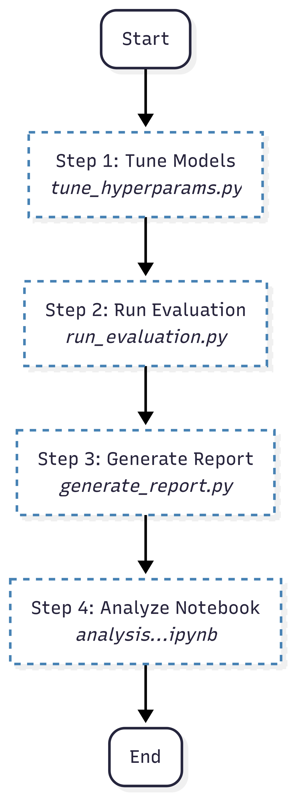

# Role Discovery in Networks

This directory contains the complete implementation for the Role Discovery task of the network science project. The goal is to partition nodes in a graph into roles based on structural equivalence, meaning nodes in the same role have similar patterns of connectivity to the rest of the network. This is fundamentally different from community detection, which groups nodes based on dense intra-connectivity.

## Table of Contents
1.  [Methodology](#methodology)
2.  [Implemented Models](#implemented-models)
3.  [Project Structure](#project-structure)
4.  [How to Run Experiments](#how-to-run-experiments)
5.  [Understanding the Results](#understanding-the-results)
6.  [Summary of Findings](#summary-of-findings)

## Methodology

We explore and compare two primary paradigms for role discovery, each with variations based on the input features provided to the model.


### 1. Traditional Method: Feature-Based Clustering
This approach first engineers a set of structural features for each node, creating a rich numerical representation. Then, a standard clustering algorithm (`K-Means`) is applied to this feature space to group nodes into roles.
* **`FeatureBasedRoles`**: Uses a vector of standard graph metrics (centrality measures, clustering coefficient, etc.) calculated with `NetworkX`.
* **`FeatureBasedRolesGraphlets`**: Uses a more powerful feature set derived from graphlet degree vectors, which count the occurrences of small induced subgraphs around each node.

### 2. Deep Learning Method: Unsupervised GNNs
This approach uses an unsupervised Graph Neural Network (GNN) to automatically learn low-dimensional node embeddings that capture structural information. These embeddings are then clustered using `K-Means`.
* **Graph Autoencoder (GAE)**: An encoder-decoder framework that learns embeddings by trying to reconstruct the graph's adjacency matrix.
* **Deep Graph Infomax (DGI)**: A contrastive method that learns node embeddings by maximizing the mutual information between local node representations and a global graph summary.

Each GNN method was tested with two different input feature sets:
* **Simple Features**: Using only the node's degree as the initial feature. (`GNNEmbedder`, `DGIEmbedder`)
* **Graphlet Features**: Using the pre-computed graphlet degree vectors as the initial features. (`GNNEmbedderGraphlets`, `DGIEmbedderGraphlets`)

## Implemented Models

The following diagram shows the architecture of the implemented models. They all inherit from a common `RoleDiscoveryModel` interface, which ensures they expose a consistent `predict()` method.


* **`FeatureBasedRoles`**: Traditional method using standard graph metrics.
* **`FeatureBasedRolesGraphlets`**: Traditional method using graphlet features.
* **`GNNEmbedder` / `GAEEmbedder`**: GAE model using node degrees as input features.
* **`GNNEmbedderGraphlets` / `GAEEmbedderGraphlets`**: GAE model using graphlet features as input.
* **`DGIEmbedder`**: DGI model using node degrees as input features.
* **`DGIEmbedderGraphlets`**: DGI model using graphlet features as input.

## Project Structure

```plaintext
role_discovery/
├── models/                   # Contains all model implementations.
├── utils/                    # Helper scripts for analysis, features, etc.
├── results/                  # All output files are saved here.
│   └── role_discovery/
│       ├── <DATASET_NAME>/   # Subdirectory for each dataset's results.
│       └── comparison_summary.csv # High-level comparison across all datasets.
├── run_evaluation.py         # Main script to run experiments and evaluation.
├── tune_hyperparams.py       # Script to perform hyperparameter tuning for GNNs.
├── generate_report.py        # Script to create the summary CSV and plots.
└── analysis_role_discovery.ipynb # Jupyter notebook for detailed result analysis.
````

## How to Run Experiments




The experiments can be run from the root directory of the project (`adriano-7-network-science/`).

### Step 1: Hyperparameter Tuning (Optional but Recommended)

Before running the final evaluation, you can tune the GNN models to find the best hyperparameters for a given dataset.

```bash
python -m project.role_discovery.tune_hyperparams 
```

This script will test a grid of parameters and save the best ones to `results/role_discovery/<dataset_name>/hyperparameter_tuning_results.csv`. It also saves the trained model weights (`.pt` files) for the best models.

### Step 2: Running the Full Evaluation

This is the main script to run all models on the specified datasets. It will evaluate each model for a range of role counts ($k$) and generate detailed results.

```bash
# Run evaluation with default parameters
python -m project.role_discovery.run_evaluation

# Run using the models from Step 1
python -m project.role_discovery.run_evaluation --use_tuned

# To use a subset of datasets (e.g Actor, Cora) , add the --dataset flag
python -m project.role_discovery.run_evaluation --dataset Actor Cora --use_tuned
```

### Step 3: Generating Summary Reports

After running the evaluation, you can generate a high-level summary CSV file and comparison plots.

```bash
# Generate report for all datasets that have been evaluated
python -m project.role_discovery.generate_report --dataset Cora Actor CLUSTER
```

This creates `results/role_discovery/comparison_summary.csv` and several summary plots.

## Understanding the Results

For each dataset (e.g., `Cora`), the `run_evaluation.py` script generates a set of files in `results/role_discovery/Cora/`:

  * `comparison_summary.csv`: A high-level summary of the best performance of each model across all datasets.
  * `hyperparameter_tuning_results.csv`: Results from the hyperparameter search.
  * `best_<MODEL>_model.pt`: The saved weights of the best-performing tuned GNN model.
  * `<MODEL>_clustering_metrics.csv`: A table of Silhouette, Davies-Bouldin, and Calinski-Harabasz scores for each value of $k$ tested.
  * `<MODEL>_k<BEST_K>_tsne.png`: A 2D t-SNE visualization of the discovered roles for the best-performing $k$.
  * `<MODEL>_k<BEST_K>_role_analysis.csv`: A table showing the average structural properties (degree, betweenness, etc.) for nodes within each discovered role.
  * `<MODEL>_k<BEST_K>_role_adj_heatmap_normalized.png`: A heatmap showing the normalized connectivity between different roles, which reveals interaction patterns.
